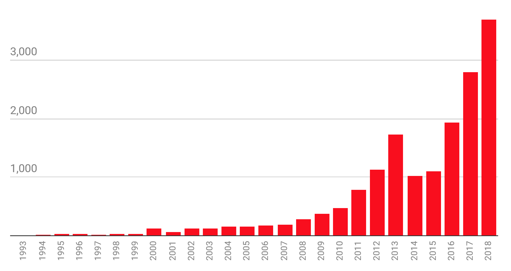

# What is Machine Learning?

General definition

<ul>
[Machine Learning is the] field of study that gives computers the ability to learn without being explicitly programmed
  <ul>
    -Arthur Samuel, 1959
  </ul>
</ul>

In a **traditional approach** to solving problems, one would study a problem, write rules (i.e. laws of physics) to solve that problem, analyze errors, then modify the rules. A **machine learning approach** automates this process: *a machine learning model modifies its rules based on the errors it measures*. This abstract statement becomes more conceptual once the mathematical foundations are established. For now, you can think of the following example: 

* One wishes to fit some data points to a best fit line $$y=ax+b$$. One chooses initial "guesses" for $$a$$ and $$b$$ and a machine learning algorithm finds the optimal values of $$a$$ and $$b$$ with respect to the mean-squared error.

There are three main tasks in machine learning:

1. **Regression**. The input is multi-dimensional data points and the output is a **real number** (or sequence of real numbers). For example, the input might be height and weight, whilst output might be resting heart rate and resting blood pressure (a sequence of real numbers).

2. **Classification**. The input is multi-dimensional data points and the output is an **integer** (which represents different classes). Consider the following example with two classes: pictures of roses and pictures of begonias. The input would be multi-dimensional images (color channel included) and one may assign the integer 0 to roses and the integer 1 to begonias. 

3. **Generation**: The input is noise and the output is something sensible. For example, training a machine learning algorithm to take in a *random seed* and generate images of peoples faces.

# What Role Does Machine Learning have in Particle Physics?

* One wants to classify detected particles as signal or background events based on their energy, momentum, charge, etc... . This specific problem was featured on Kaggle 6 years ago [here](https://www.kaggle.com/c/higgs-boson/data). This problem will also be examined in this tutorial.
* (My research) I want to make measurements of a rare process. Background processes that look similar to the rare signal process are much more common. A machine learning technique can optimise at the same time the use of many variables that separate signal and background. Not only does a machine learning technique optimise the use of many variables at the same time, but it can find correlations in many dimensions that will give better signal/background classification than individual variables ever could. This is an example of classification in action.

Machine learning has become quite popular in scientific fields in the past few years. The following plot from [MIT Technical Review](https://www.technologyreview.com/2019/01/25/1436/we-analyzed-16625-papers-to-figure-out-where-ai-is-headed-next/) examines the number of papers available in the “artificial intelligence” section of arXiv up to November 18, 2018.

{:width="80%"}

The following are a few recent articles on machine learning in particle physics

* [Machine and Deep Learning Applications in Particle Physics](https://arxiv.org/abs/1912.08245)
* [Machine learning at the energy and intensity frontiers of particle physics](https://www.nature.com/articles/s41586-018-0361-2)

# Where to Become Proficient in Machine Learning

Machine Learning is not something you'll learn in an hour. It's a skill you need to develop over time, and like any skill you need to practice a little bit every day. If you want to really *excel* at machine learning, my recommendation is to try an online course such as [this one](https://www.coursera.org/learn/machine-learning). If textbooks are your thing, try [this book](https://www.oreilly.com/library/view/hands-on-machine-learning/9781492032632/), ensuring to **read and code along with each chapter**. Don't go crazy: just do 30 minutes a day. You'd be surprised how much you could learn in a couple months. In summary:

* **For Learning Essential Python libraries**: [this textbook](https://www.amazon.ca/Python-Data-Analysis-Wrangling-IPython-ebook/dp/B075X4LT6K/ref=sr_1_1?crid=WLIHOCVH891S&dchild=1&keywords=python+for+data+analysis%2C+2nd+edition&qid=1593460237&sprefix=python+for+data+%2Caps%2C196&sr=8-1) or [this online article for an introduction](https://dev.to/marsja/essential-python-libraries-for-data-science-machine-learning-and-statistics-5175)
* **For Learning Machine Learning libraries**: [this textbook](https://www.oreilly.com/library/view/hands-on-machine-learning/9781492032632/) or [this online article for an introduction](https://blog.bitsrc.io/top-5-javascript-machine-learning-libraries-604e52acb548)

Just for a bit of perspective, I started learning about machine learning in April 2019. Don't expect the learning process to be a quick one: follow online courses and code along with them. If you have a textbook, read through it thoroughly and make sure you code along with the textbook.



