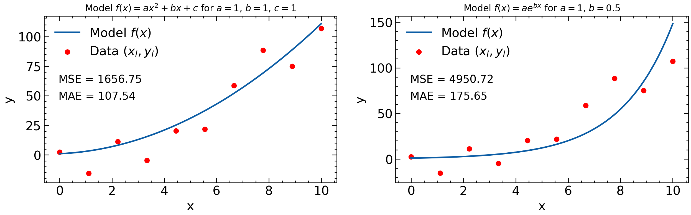
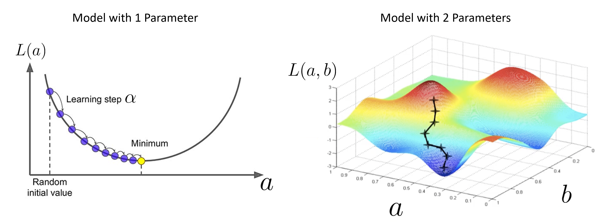
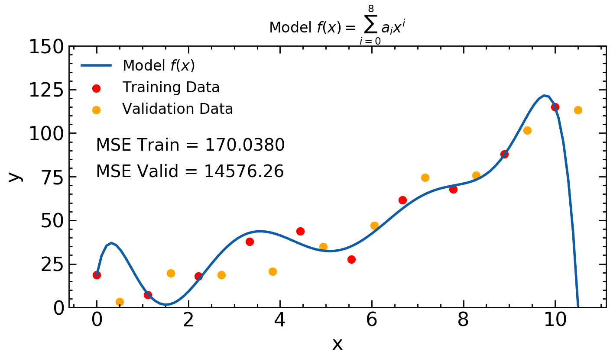

 
 In this section we will establish the mathematical foundations of machine learning. We will define three important quantities: **data**, **models**, and **loss functions**. We will then discuss the optimization procedure known as **gradient descent**.
 
 # Definitions
 
  * **Data** $$(x_i, y_i)$$ where $$i$$ represents the ith data point. The $$x_i$$ are typically referred to as **instances** and the $$y_i$$ as **labels**. In general the $$x_i$$ and $$y_i$$ don't need to be numbers. For example, in a dataset consisting of pictures of animals, the $$x_i$$ might be images (consisting of height, width, and color channel) and the $$y_i$$ might be a string which states the type of animal.  
  
* **Model**: Some abstract function $$f$$ such that $$y=f(x;\theta)$$ is used to model the individual $$(x_i, y_i)$$ pairs. $$\theta$$ is used to represent all necessary parameters in the function, so it can be thought of as a vector. For example, if the $$(x_i, y_i)$$ are real numbers and approximately related through a quadratic function, then an adequate model might be $$f(x;a,b,c)=ax^2+bx+c$$ Note that one could also use the model $$f(x;a,b,c,...)=ax^3+b\sin(x)+ce^x + ...$$ to model the data set; a model is just *some* function; it doesn't need to model the data well necessarily. For the case where the $$x_i$$ are pictures of animals and the $$y_i$$ are strings of animal names, the function $$f$$ may need to be quite complex to achieve reasonable accuracy. 

* **Loss Function**: A function that determines *how well the model $$y=f(x)$$ predicts the data $$(x_i, y_i)$$*. Some models work better than others. One such loss function might be $$\sum_i (y_i-f(x_i))^2$$: the mean-squared error. For the quadratic function this would be $$\sum_i (y_i-(ax_i^2+bx_i+c))^2$$. One doesn't need to use the mean-squared error (MSE) as a loss function, however; one could also use the mean-absolute error (MAE), or the mean-cubed error, etc. What about cases where the $$x_i$$ represent pictures of animals and the $$y_i$$ are strings representing the animal in the picture? How can we define a loss funtion to account for the *error* the function made when classifying this picture? In this case one needs to be clever about loss functions as functions like the MSE or MAE don't make sense anymore. A common loss function in this case is the *crossentropy loss function*.

{:width="80%"}

What's important to note is that once the data and model are specified, then the loss function depends on the parameters of the model. For example, consider the data points $$(x_i, y_i)$$ in the plot above and the MSE loss function.  For the left hand plot the model is $$y=ax^2+bx+c$$ and so the MSE depends on $$a$$, $$b$$, and $$c$$ and $$L=L(\theta)=L(a,b,c)$$. For the right hand plot, however, the model is $$y=ae^{bx}$$ and so in this case the MSE only depends on two parameters: $$a$$ and $$b$$ and $$L(\theta)=L(a,b)$$.

# Gradient Descent

For most applications, the goal of machine learning is to optimize a loss function with respect to the parameters of a model given a data set and a model. Lets suppose we have the dataset $$(x_i, y_i)$$, the model $$y=ax^2+bx+c$$, and the loss function $$L(\theta) = L(a, b, c) = \sum_i (y_i-(ax_i^2+bx_i+c))^2$$ to determine the validity of the model. We want to minimize the loss function with respect to $$a$$, $$b$$, and $$c$$ (thus creating the best model). One such way to do this is to pick some random initial values for $$a$$, $$b$$, and $$c$$ and then do then repeat the following two steps until we reach a minimum for $$L(a,b,c)$$

1. Evaluate the gradient $$\nabla L_{\theta}$$. The negative gradients points to where the function $$L($$\theta$$)$$ is decreasing.

2. Update $$\theta \to \theta - \alpha \nabla_{\theta} L$$ The parameter $$\alpha$$ is known as the **learning rate** in machine learning.

This procedure is known as **gradient descent** in machine learning. It's sort of like being on a mountain, and only looking at your feet to try and reach the bottom. You'll likely move in the direction where the slope is decreasing the fastest. The problem with this technique is that it may lead you into local minima (places where the mountain has "pits" but you're not at the base of the mountain).

{:width="80%"}

Note that the models in the plots above have 1 (left) and 2 (right) parameters. A typical neural network can have $$O(10^4)$$ parameters. In such a situation, the gradient is a vector with dimensions $$O(10^4)$$; this can be computational expensive to compute. In addition the gradient $$\nabla_{\theta} L$$ depends on *all the data points* $$(x_i, y_i)$$. This is often computationally expensive for datasets that include many data points. Typical machine learning data sets can have millions of (multi-dimesional) data points. A solution to this is to sample a different small subset of points each time the gradient is computed. This is known as **batch gradient descent**.  

# The Fly in the Ointment: Overfitting

In general, a model with more parameters can fit a more complicated data set. Consider the following plot

{:width="80%"}

* The red and orange data points are both taken from the same population
* The model is only trained on the red data points
* The mean squared error is much lower for the points which the model was exposed to.

This phenomenon is known as overfitting in machine learning. In general you want to train the model on some known data points $$(x_i,y_i)$$ and then use the model to make predictions on new data points, but if the model is overfitting then the predictions for the new data points will be inaccurate.

The main way to avoid this phenomenon in machine learning is by using what is known as a **training** set $$(x_i, y_i)_t$$ and a **validation** set $$(x_i, y_i)_v$$. The training set typically consists of 60%-80% of your data and the validation set consists of the rest of the data. During training, one only uses the the the training set to tune $$\theta$$. One can then determine if the model is overfitting by comparing $$L(\theta)$$ for the training set and the validation set. Typically the model will start to overfit after a certain number of gradient descent steps: a straightforward way to stop overfitting is to stop adjusting $$\theta$$ using gradient descent when the loss function starts to significantly differ to training and validation.

A few common model functions $$f$$ in machine learning:
* Support Vector Machines
* Decision Trees
* Random Forests
* Neural networks (Artifical, Convolutional, Recurrent, ...)

The two main tasks of machine learning can now be revsisted with the mathematical formulation.

1. **Regression**. The data in this case is $$(x_i, y_i)$$ where the $$y_i$$ are real numbers. For example each instance $$x_i$$ might specify the height and weight of a person and $$y_i$$ the corresponding resting heart rate of the person. A common loss function for this type of problem is the MSE.

2. **Classification**. The data in this case is $$(x_i, y_i)$$ where $$y_i$$ are discrete values that represent classes. For example each instance $$x_i$$ might specify the petal width and height of a flower and each $$y_i$$ would then specify the corresponding type of flower. A common loss function for this type of problem is cross entropy. In these learning tasks, a machine learning model typically predicts the *probability* that a given $$x_i$$ corresponds to a certain class. Hence if the possible classes in the problem are $$(C_1, C_2, C_3, C_4)$$ then the model would output an array $$(p_1, p_2, p_3, p_4)$$ where $$\sum_i p_i = 1$$ for each $$y_i$$.


