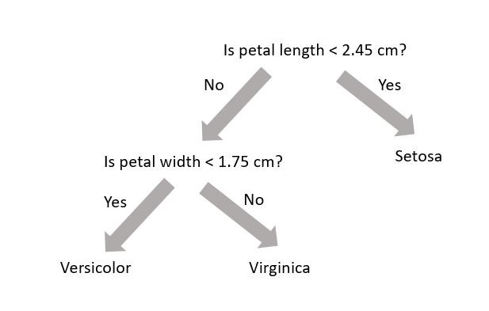

# Models

In this section we will examine 2 different machine learning models $$f$$ for classification: the random forest (RF) and the fully connected neural network (NN).

## Random Forest
A random forest (see [Chapter 7](https://www.oreilly.com/library/view/hands-on-machine-learning/9781492032632/) or [Wikipedia](https://en.wikipedia.org/wiki/Random_forest)) uses decision trees (see [Chapter 6](https://www.oreilly.com/library/view/hands-on-machine-learning/9781492032632/) or [Wikipedia](https://en.wikipedia.org/wiki/Decision_tree_learning)) to make predictions. Decision trees are very simple models that make classification predictions by performing selections on regions in the data set. The diagram below shows a decision tree for classifying three different types of iris flower species.

{:width="80%"}

A decision tree is not trained using gradient descent and a loss function; training is completed using the *Classification and Regression Tree* (CART) algorithm.  While each decision tree is a simple algorithm, a random forest uses **ensemble learning** with many decision trees to make better predictions. A random forest is considered a **black-box model** while a decision tree is considered a **white-box model**.

> ## Model Interpretation: White Box vs. Black Box
> Decision trees are intuitive, and their decisions are easy to interpret. Such models are considered white-box models. In contrast, random forests or neural networks are generally considered black-box models. They can make great predictions but it is usually hard to explain in simple terms why the predictions were made. For example, if a neural network says that a particular person appears on a picture, it is hard to know what contributed to that prediction. Was it their mouth? Their nose? Their shoes? Or even the couch they were sitting on? Conversely, decision trees provide nice, simple classification rules that can be applied manually if need be.
{: .callout}

The diagram below is a visual representation of random forests; there are $$B$$ decision trees and each decision tree $$\text{tree}_j$$ makes the prediction that a particular data point $$x$$ belongs to the class $$k_j$$. Each decision tree has a varying level of confidence in their prediction. Then, using weighted voting, all the predictions $$k_1,...k_B$$ are considered together to generate a single prediction that the data point $$x$$ belongs to class $$k$$.

{:width="80%"}

> ## Wisdom of the Crowd (Ensemble Learning)
> Suppose you pose a complex question to thousands of random people, then aggregrate their answers. In many cases you will find that this aggregreated answer is better than an expert's answer. This phenomenon is  known as *wisdom of the crowd*. Similarly, if you aggregrate the predictions from a group of predictors (such as classifiers or reggressors), you will often get better predictions than with the individual predictor. A group of predictors is called an *ensemble*. For an interesting example of this phenomenon in estimating the weight of an ox, see [this national geographic article](https://www.nationalgeographic.com/science/phenomena/2013/01/31/the-real-wisdom-of-the-crowds/). 
{: .callout}

In the previous page we created a training and test dataset. Lets use these datasets to train a random forest.

~~~
from sklearn.ensemble import RandomForestClassifier

RF_clf = RandomForestClassifier(criterion='gini', max_depth=8, n_estimators=30)
RF_clf.fit(X_train, y_train)
y_pred_RF = RF_clf.predict(X_test)

# See how well the classifier does
print(accuracy_score(y_test, y_pred_RF))
~~~
{: .language-python}

1. The classifier is created. In this situation we have three hyperparameters specified: `criterion`, `max_depth` (max number of consecutive cuts an individual tree can make), and `n_estimators` (number of decision trees used). These **are not altered** during training (i.e. they are not included in $$\theta$$).
2. The classifier is trained using the training dataset `X_train` and corresponding labels `y_train`.
3. The classifier makes predictions on the test dataset `X_test`. The machine learning algorithm was not exposed to these data during training.
4. An accuracy score between the test dataset `y_test` and machine learning predictions `y_pred` is made. The accuracy score is defined as the ratio of correctly identified data points to all data points.
 
## Neural Network
A neural network is a black-box model with many hyperparameters. We will discuss the mathematical structure of neural networks later on in the tutorial. If you are interested in neural networks, I would highly recommend reading [Chapter 10](https://www.oreilly.com/library/view/hands-on-machine-learning/9781492032632/) of the textbook (and [Chapters 11-18](https://www.oreilly.com/library/view/hands-on-machine-learning/9781492032632/) as well, for that matter). It is also discussed [here](https://lukepolson.github.io/HEP_ML_Lessons/07-nn/index.html) in the tutorial. To use a neural network with scikit-learn, we must modularize its construction using a function. We will later pass this function into a Keras wrapper.

~~~
def build_model(n_hidden=1, n_neurons=5, learning_rate=1e-3):
    # Build
    model = keras.models.Sequential()
    for layer in range(n_hidden):
        model.add(keras.layers.Dense(n_neurons, activation="relu"))
    model.add(keras.layers.Dense(2, activation='softmax'))
    # Compile
    optimizer = keras.optimizers.SGD(lr=learning_rate)
    model.compile(loss='sparse_categorical_crossentropy', optimizer=optimizer, metrics=['accuracy'])
    return model
~~~
{: .language-python}

For now, ignore all the complicated hyperparameters, but note that the loss used is `sparse_categorical_crossentropy`; the neural network uses gradient descent to optimize its parameters (in this case these parameters are *neuron weights*). The network can be trained as follows:

~~~
X_valid, X_train_nn = X_train[:100], X_train[100:]
y_valid, y_train_nn = y_train[:100], y_train[100:]

NN_clf = keras.wrappers.scikit_learn.KerasClassifier(build_model)
NN_clf.fit(X_train, y_train, validation_data=(X_valid, y_valid))
y_pred_NN = NN_clf.predict(X_test)

# See how well the classifier does
print(accuracy_score(y_test, y_pred_NN))
~~~
{: .language-python}

The neural network should also have a similar accuracy score to the random forest. Note that while the accuracy is one metric for the strength of a classifier, many other metrics exist as well. We will examine these metrics in the next section.

> ## Accuracy: The Naive Metric
> Suppose you have a dataset where 90% of the dataset is background and 10% of the dataset is signal. Now suppose we have a dumb classifier that classifies every data point as background. In this example, the classifier will have 90% accuracy! This demonstrates why accuracy is generally not the preferred performance measure for classifiers, especially when you are dealing with *skewed* datasets. Skewed datasets show up all the time in particle physics where one has access to many more background than signal events. In this particular tutorial, we have a dataset with 520000 background events and 370000 signal events.
{: .callout}
