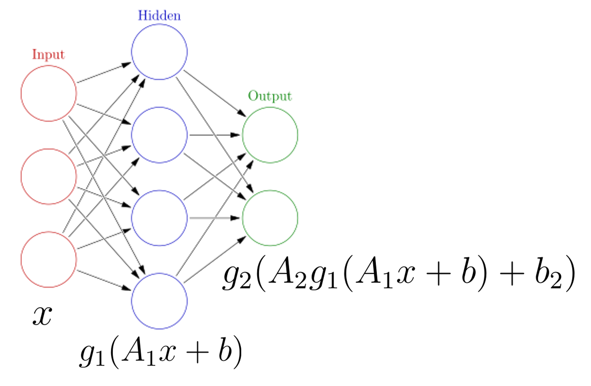

# Neural Network Theory Introduction
Here we will introduce the mathematics of a neural network. You are likely familiar with the linear transform $$y=Ax+b$$ where $$A$$ is a matrix (not necessarily square) and $$y$$ and $$b$$ have the same dimensions and $$x$$ may have a different dimension. For example, if $$x$$ has dimension $$n$$ and $$y$$ and $$b$$ have dimensions $$m$$ then the matrix $$A$$ has dimension $$m$$ by $$n$$.

Now suppose we have some vector $$x_i$$ listing some features (height, weight, body fat) and $$y_i$$ contains blood pressure and resting heart rate. A simple linear model to predict the label features given the input features is then  $$y=Ax+b$$ or $$f(x)=Ax+b$$. But we can go further. Suppose we also apply a *simple* but *non-linear* function $$g$$ to the output so that $$f(x) = g(Ax+b)$$. This function $$g$$ does not change the dimension of $$Ax+b$$ as it is an *element-wise* operation. This function $$g$$ is known as an **activation function**; a few activation functions $$g$$ are shown below.

{:width="80%"}

Now we can perform a sequence of operations to construct a highly non-linear function. For example; we can construct the following model:

$$f(x) = g_2(A_2(g_1(A_1x+b_1))+b_2) $$

We first perform a linear transformation, then apply activation function $$g_1$$, then perform another linear transformation, then apply activation function $$g_2$$. The input $$x$$ and the output $$f(x)$$ are not necessarily the same dimension.

For example, suppose we have an image (which we flatten into a 1d array). This array might be 40000 long. We can perform one iteration of $$g_1(A_1x+b_1)$$ to reduce this to a size of 2000. We can apply this over and over again until eventually only a single value is output. This is the foundation of a  **fully connected neural network**. Note we can also increase the dimensions throughout the process, as seen in the image below. We start with a vector $$x$$ of size 3, perform the transformation $$g_1(A_1x+b_1)$$ so the vector is size 4, then perform one final transformation so the vector is size 2.

{:width="80%"}

Neural networks require a careful training procedure. Suppose we are performing a regression task (for example we are given temperature, wind speed, wind direction, pressure and asked to predict relative humidity). The final output of the neural network will be a single value. During training, we compare the outputs of the neural network $$f(x_i)$$ to the true values of the data $$y_i$$ using some loss function $$L$$. We need to tune the parameters of the model so that $$L$$ is as small as possible. What are the parameters of the model in this case? The parameters are the elements of the matrices $$A_1, A_2, ...$$ and the vectors $$b_1, b_2, ...$$. We also need to adjust them in an appropriate fashion so we are moving closer to the minmimum of $$L$$. For this we need to compute $$\nabla L$$, and using a clever technique (known as back-propagation), we can determine exactly how much each parameter (i.e. each entry in matrix $$A_i$$) contributes to $$\nabla L$$. Then we slightly adjust each parameter such that $$\vec{L} \to \vec{L}-\alpha \nabla{L}$$ where, like before, $$\alpha$$ is the learning rate. Through this iterative procedure, we slowly minimize the loss function.

* The vector $$x$$ is referred to as the **input layer** of the network
* Intermediate quantities (such as $$g_1(A_1x+b_1)$$) are referred to as **hidden layers**. Each element of the vector $$g_1(A_1x+b_1)$$ is referred to as a **neuron**.
* The model output $$f(x)$$ is referred to as the **output layer**. Note that *activation functions are generally not used in the output layer*.

# TensorFlow Playground

See [here](https://playground.tensorflow.org/) 
