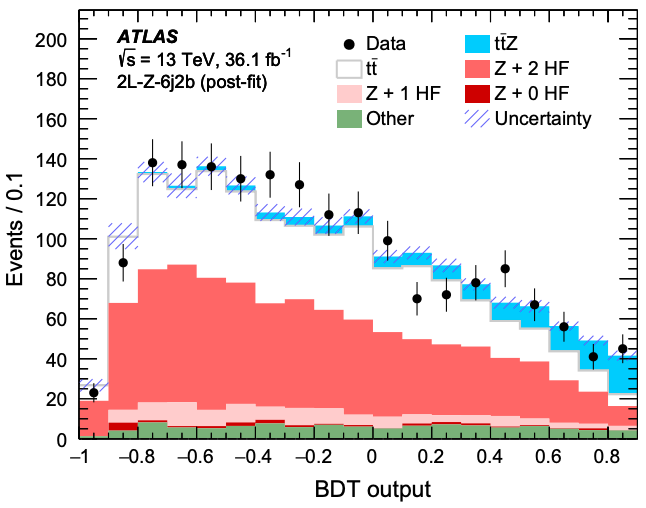

<iframe width="427" height="251" src="https://www.youtube.com/embed?v=HePrmoE8XRU&list=PLKZ9c4ONm-VmHsMKImIDEMsZI1Vp0UY-Z&index=12&ab_channel=HEPSoftwareFoundation" frameborder="0" allow="accelerometer; autoplay; encrypted-media; gyroscope; picture-in-picture" allowfullscreen></iframe>

We've already trained some machine learning models on a particular dataset, that for Higgs boson decay to 4 leptons. Now let's try a different dataset. This will show you the process of using the same algorithms on different datasets. Another thing that will come out of this is that separate optimisation is needed for different datasets.

# Data Discussion

## New Dataset Used

The new dataset we will use in this tutorial is ATLAS data for a different process. The data were collected with the ATLAS detector at a proton-proton (pp) collision
energy of 13 TeV. Monte Carlo (MC) simulation samples are used to model the expected signal and background distributions
All samples were processed through the
same reconstruction software as used for the data. Each event corresponds to 2 detected leptons and at least 6 detected jets, at least 2 of which are b-tagged jets. Some events correspond to a rare top-quark (signal) process ($$t\bar{t}Z$$) and others do not (background). Various physical quantities such as jet transverse momentum are reported for each event. The analysis here closely follows [this ATLAS published paper studying this rare process](https://journals.aps.org/prd/pdf/10.1103/PhysRevD.99.072009).

The signal process is called 'ttZ'. The background processes are called 'ttbar','Z2HF','Z1HF','Z0HF' and 'Other'.

> ## Challenge
> Define a list `samples_ttZ` containing 'Other','Z1HF','Z2HF','ttbar','ttZ'. (You can add 'Z0HF' later). This is similar to `samples` in [the 'Data Discussion' lesson](https://hsf-training.github.io/hsf-training-ml-webpage/06-Data_Discussion/index.html).
>
> > ## Solution
> > ~~~
> > samples_ttZ = ['Other','Z1HF','Z2HF','ttbar','ttZ'] # start with only these processes, more can be added later.
> > ~~~
> > {: .language-python}
> {: .solution}
{: .challenge}

## Exploring the Dataset

Here we will format the dataset $$(x_i, y_i)$$ so we can explore! First, we need to open our data set and read it into pandas DataFrames.

> ## Challenge
> 1. Define an empty dictionary `DataFrames_ttZ` to hold your ttZ dataframes. This is similar to `DataFrames` in [the 'Data Discussion' lesson](https://hsf-training.github.io/hsf-training-ml-webpage/06-Data_Discussion/index.html).
> 2. Loop over `samples_ttZ` and read the csv files in '/kaggle/input/ttz-csv/' into `DataFrames_ttZ`. This is similar to reading the csv files in [the 'Data Discussion' lesson](https://hsf-training.github.io/hsf-training-ml-webpage/06-Data_Discussion/index.html).
>
> > ## Solution
> > ~~~
> > # get data from files
> > DataFrames_ttZ = {} # define empty dictionary to hold dataframes
> > for s in samples_ttZ: # loop over samples
> >     DataFrames_ttZ[s] = pd.read_csv('/kaggle/input/ttz-csv/'+s+".csv") # read .csv file
> > ~~~
> > {: .language-python}
> {: .solution}
{: .challenge}

We've already cleaned up this dataset for you and calculated some interesting features, so that you can dive straight into machine learning!

In the [ATLAS published paper studying this process](https://journals.aps.org/prd/pdf/10.1103/PhysRevD.99.072009), there are 17 variables used in their machine learning algorithms.

Imagine having to separately optimise these 17 variables! Not to mention that applying a cut on one variable could change the distribution of another, which would mean you'd have to re-optimise... Nightmare.

This is where a machine learning model can come to the rescue. A machine learning model can optimise all variables at the same time.

A machine learning model not only optimises cuts, but can find correlations in many dimensions that will give better signal/background classification than individual cuts ever could.

That's the end of the introduction to why one might want to use a machine learning model. If you'd like to try using one, just keep reading!

# Data Preprocessing

## Format the data for machine learning

It's almost time to build a machine learning model!

> ## Challenge
> First create a list `ML_inputs_ttZ` of variables 'pt4_jet','pt6_jet','dRll','NJetPairsZMass','Nmbjj_top','MbbPtOrd','HT_jet6','dRbb' to use in our machine learning model. (You can add the other variables in later). This is similar to `ML_inputs` in [the 'Data Preprocessing' lesson](https://hsf-training.github.io/hsf-training-ml-webpage/07-Data_Preprocessing/index.html).
>
> > ## Solution
> > ~~~
> > ML_inputs_ttZ = ['pt4_jet','pt6_jet','dRll','NJetPairsZMass','Nmbjj_top','MbbPtOrd','HT_jet6','dRbb'] # list of features for ML model
> > ~~~
> > {: .language-python}
> {: .solution}
{: .challenge}

Definitions of these variables can be found in the [ATLAS published paper studying this process](https://journals.aps.org/prd/pdf/10.1103/PhysRevD.99.072009).

 The data type is currently a pandas DataFrame: we now need to convert it into a NumPy array so that it can be used in scikit-learn and TensorFlow during the machine learning process. Note that there are many ways that this can be done: in this tutorial we will use the NumPy **concatenate** functionality to format our data set. For more information, please see [the NumPy documentation on concatenate](https://numpy.org/doc/stable/reference/generated/numpy.concatenate.html).

> ## Challenge
> 1. Create an empty list `all_MC_ttZ`. This is similar to `all_MC` in [the 'Data Preprocessing' lesson](https://hsf-training.github.io/hsf-training-ml-webpage/07-Data_Preprocessing/index.html).
> 2. Create an empty list `all_y_ttZ`. This is similar to `all_y` in [the 'Data Preprocessing' lesson](https://hsf-training.github.io/hsf-training-ml-webpage/07-Data_Preprocessing/index.html).
> 3. loop over `samples_ttZ`. This is similar to looping over `samples` in [the 'Data Preprocessing' lesson](https://hsf-training.github.io/hsf-training-ml-webpage/07-Data_Preprocessing/index.html).
> 4. (at each pass through the loop) if currently processing a sample called 'data': continue
> 5. (at each pass through the loop) append the subset of the DataFrame for this sample containing the columns for `ML_inputs_ttZ` to to the list `all_MC_ttZ`. This is similar to the append to `all_MC` in [the 'Data Preprocessing' lesson](https://hsf-training.github.io/hsf-training-ml-webpage/07-Data_Preprocessing/index.html).
> 6. (at each pass through the loop) if currently processing a sample called 'ttZ': append an array of ones to `all_y_ttZ`. This is similar to the signal append to `all_y` in [the 'Data Preprocessing' lesson](https://hsf-training.github.io/hsf-training-ml-webpage/07-Data_Preprocessing/index.html).
> 7. (at each pass through the loop) else: append an array of zeros to `all_y_ttZ`. This is similar to the background append to `all_y` in [the 'Data Preprocessing' lesson](https://hsf-training.github.io/hsf-training-ml-webpage/07-Data_Preprocessing/index.html).
>
> > ## Solution to part 1
> > ~~~
> > all_MC_ttZ = [] # define empty list that will contain all features for the MC
> > ~~~
> > {: .language-python}
> {: .solution}
>
> > ## Solution to part 2
> > ~~~
> > all_y_ttZ = [] # define empty list that will contain all labels for the MC
> > ~~~
> > {: .language-python}
> {: .solution}
>
> > ## Solution to parts 3,4,5,6,7
> > ~~~
> > for s in samples_ttZ: # loop over the different samples
> >     if s=='data': continue # only MC should pass this
> >     all_MC_ttZ.append(DataFrames_ttZ[s][ML_inputs_ttZ]) # append the MC dataframe to the list containing all MC features
> >     if s=='ttZ': all_y_ttZ.append(np.ones(DataFrames_ttZ[s].shape[0])) # signal events are labelled with 1
> >     else: all_y_ttZ.append(np.zeros(DataFrames_ttZ[s].shape[0])) # background events are labelled 0
> > ~~~
> > {: .language-python}
> {: .solution}
{: .challenge}

> ## Challenge
> Run the previous cell and start a new cell.
> 1. concatenate the list `all_MC_ttZ` into an array `X_ttZ`. This is similar to `X` in [the 'Data Preprocessing' lesson](https://hsf-training.github.io/hsf-training-ml-webpage/07-Data_Preprocessing/index.html).
> 2. concatenate the list `all_y_ttZ` into an array `y_ttZ`. This is similar to `y` in [the 'Data Preprocessing' lesson](https://hsf-training.github.io/hsf-training-ml-webpage/07-Data_Preprocessing/index.html).
>
> > ## Solution to part 1
> > ~~~
> > X_ttZ = np.concatenate(all_MC_ttZ) # concatenate the list of MC dataframes into a single 2D array of features, called X
> > ~~~
> > {: .language-python}
> {: .solution}
>
> > ## Solution to part 2
> > ~~~
> > y_ttZ = np.concatenate(all_y_ttZ) # concatenate the list of labels into a single 1D array of labels, called y
> > ~~~
> > {: .language-python}
> {: .solution}
{: .challenge}

You started from DataFrames and now have a NumPy array consisting of only the DataFrame columns corresponding to `ML_inputs_ttZ`.

Now we are ready to examine various models $$f$$ for predicting whether an event corresponds to a signal event or a background event.

# Model Training

## Random Forest

You've just formatted your dataset as arrays. Lets use these datasets to train a random forest. The random forest is constructed and trained against all the contributing backgrounds

> ## Challenge
> 1. Define a new `RandomForestClassifier` called `RF_clf_ttZ` with `max_depth=8,n_estimators=30` as before. This is similar to defining `RF_clf` in [the 'Model Training' lesson](https://hsf-training.github.io/hsf-training-ml-webpage/09-Model_Training/index.html).
> 2. `fit` your `RF_clf_ttZ` classifier to `X_ttZ` and `y_ttZ`. This is similar to the `fit` to `RF_clf` in [the 'Model Training' lesson](https://hsf-training.github.io/hsf-training-ml-webpage/09-Model_Training/index.html).
>
> > ## Solution to part 1
> > ~~~
> > RF_clf_ttZ = RandomForestClassifier(max_depth=8, n_estimators=30) # initialise your random forest classifier
> > # you may also want to specify criterion, random_seed
> > ~~~
> > {: .language-python}
> {: .solution}
>
> > ## Solution to part 2
> > ~~~
> > RF_clf_ttZ.fit(X_ttZ, y_ttZ) # fit to the data
> > ~~~
> > {: .language-python}
> {: .solution}
{: .challenge}

1. The classifier is created.
2. The classifier is trained using the dataset `X_ttZ` and corresponding labels `y_ttZ`. During training, we give the classifier both the features (X_ttZ) and targets (y_ttZ) and it must learn how to map the data to a prediction. The fit() method returns the trained classifier. When printed out all the hyper-parameters are listed. Check out this [online article](https://towardsdatascience.com/random-forest-in-python-24d0893d51c0) for more info.

# Applying to Experimental Data

We first need to get the real experimental data.

> ## Challenge to end all challenges
> 1. Read data.csv like in the [Data Discussion lesson](https://hsf-training.github.io/hsf-training-ml-webpage/06-Data_Discussion/index.html). data.csv is in the same file folder as the files we've used so far for this new dataset.
> 2. Convert the data to a NumPy array, `X_data_ttZ`, similar to the [Data Preprocessing lesson](https://hsf-training.github.io/hsf-training-ml-webpage/07-Data_Preprocessing/index.html). You may find the attribute `.values` useful to convert a pandas DataFrame to a Numpy array.
> 3. Define an empty list `thresholds_ttZ` to hold classifier probability predictions for each sample. This is similar to `thresholds` in [the 'Applying to Experimental Data' lesson](https://hsf-training.github.io/hsf-training-ml-webpage/12-Experimental_Data/index.html).
> 4. Define empty lists `weights_ttZ` and `colors_ttZ` to hold weights and colors for each sample. Simulated events are weighted so that the object
identification, reconstruction and trigger efficiencies, energy scales and energy resolutions match those
determined from data control samples.
>
> > ## Solution to part 1
> > ~~~
> > DataFrames_ttZ['data'] = pd.read_csv('/kaggle/input/ttz-csv/data.csv') # read data.csv file
> > ~~~
> > {: .language-python}
> {: .solution}
>
> > ## Solution to part 2
> > ~~~
> > X_data_ttZ = DataFrames_ttZ['data'][ML_inputs_ttZ].values # .values converts straight to NumPy array
> > ~~~
> > {: .language-python}
> {: .solution}
>
> > ## Solution to part 3
> > ~~~
> > thresholds_ttZ = [] # define list to hold classifier probability predictions for each sample
> > ~~~
> > {: .language-python}
> {: .solution}
>
> > ## Solution to part 4
> > ~~~
> > weights_ttZ = [] # define list to hold weights for each simulated sample
> > colors_ttZ = [] # define list to hold colors for each sample being plotted
> > ~~~
> > {: .language-python}
> {: .solution}
{: .challenge}

Let's make a plot where we directly compare real, experimental data with all simulated data.

~~~
# dictionary to hold colors for each sample
colors_dict = {
    "Other": "#79b278",
    "Z0HF": "#ce0000",
    "Z1HF": "#ffcccc",
    "Z2HF": "#ff6666",
    "ttbar": "#f8f8f8",
    "ttZ": "#00ccfd",
}

mc_stat_err_squared = np.zeros(
    10
)  # define array to hold the MC statistical uncertainties, 1 zero for each bin
for s in samples_ttZ:  # loop over samples
    X_s = DataFrames_ttZ[s][
        ML_inputs_ttZ
    ]  # get ML_inputs_ttZ columns from DataFrame for this sample
    predicted_prob = RF_clf_ttZ.predict_proba(X_s)  # get probability predictions
    predicted_prob_signal = predicted_prob[
        :, 1
    ]  # 2nd column of predicted_prob corresponds to probability of being signal
    thresholds_ttZ.append(
        predicted_prob_signal
    )  # append predict probabilities for each sample
    weights_ttZ.append(
        DataFrames_ttZ[s]["totalWeight"]
    )  # append weights for each sample
    weights_squared, _ = np.histogram(
        predicted_prob_signal,
        bins=np.arange(0, 1.1, 0.1),
        weights=DataFrames_ttZ[s]["totalWeight"] ** 2,
    )  # square the totalWeights
    mc_stat_err_squared = np.add(
        mc_stat_err_squared, weights_squared
    )  # add weights_squared for s
    colors_ttZ.append(colors_dict[s])  # append colors for each sample
mc_stat_err = np.sqrt(mc_stat_err_squared)  # statistical error on the MC bars

# plot simulated data
mc_heights = plt.hist(
    thresholds_ttZ,
    bins=np.arange(0, 1.1, 0.1),
    weights=weights_ttZ,
    stacked=True,
    label=samples_ttZ,
    color=colors_ttZ,
)

mc_tot = mc_heights[0][-1]  # stacked simulated data y-axis value

# plot the statistical uncertainty
plt.bar(
    np.arange(0.05, 1.05, 0.1),  # x
    2 * mc_stat_err,  # heights
    bottom=mc_tot - mc_stat_err,
    color="none",
    hatch="////",
    width=0.1,
    label="Stat. Unc.",
)

predicted_prob_data = RF_clf_ttZ.predict_proba(
    X_data_ttZ
)  # get probability predictions on data
predicted_prob_data_signal = predicted_prob_data[
    :, 1
]  # 2nd column corresponds to probability of being signal
data_hist_ttZ, _ = np.histogram(
    predicted_prob_data_signal, bins=np.arange(0, 1.1, 0.1)
)  # histogram the experimental data
data_err_ttZ = np.sqrt(data_hist_ttZ)  # get error on experimental data
plt.errorbar(
    x=np.arange(0.05, 1.05, 0.1),
    y=data_hist_ttZ,
    yerr=data_err_ttZ,
    label="Data",
    fmt="ko",
)  # plot the experimental data
plt.xlabel("Threshold")
plt.legend()
~~~
{: .language-python}

Within errors, the real experimental data errorbars agree with the simulated data histograms. Good news, our random forest classifier model makes sense with real experimental data!

This is already looking similar to Figure 10(c) from [the ATLAS published paper studying this process](https://journals.aps.org/prd/pdf/10.1103/PhysRevD.99.072009). Check you out, recreating science research!

{:width="40%"}

Can you do better? Can you make your graph look more like the published graph? Have we forgotten any steps before applying our machine learning model to data? How would a different machine learning model do?

Here are some suggestions that you could try to go further:

> ## Going further
> 1. **Add variables into your machine learning models**. Start by adding them in the list of `ML_inputs_ttZ`. See how things look with all variables added.
> 2. **Add in the other background samples** in `samples_ttZ` by adding the files that aren't currently being processed. See how things look with all added.
> 3. **Modify some Random Forest hyper-parameters** in your definition of `RF_clf_ttZ`. You may find the [sklearn documentation on RandomForestClassifier](https://scikit-learn.org/stable/modules/generated/sklearn.ensemble.RandomForestClassifier.html) helpful.
> 4. **Give your neural network a go!**. Maybe your neural network will perform better on this dataset? You could use PyTorch and/or TensorFlow.
> 5. **Give a BDT a go!**. In [the ATLAS published paper studying this process](https://journals.aps.org/prd/pdf/10.1103/PhysRevD.99.072009), they used a Boosted Decision Tree (BDT). See if you can use `GradientBoostingClassifier` rather than `RandomForestClassifier`.
> 6. **How important is each variable?**. Try create a table similar to the 6j2b column of Table XI of [the ATLAS published paper studying this process](https://journals.aps.org/prd/pdf/10.1103/PhysRevD.99.072009). `feature_importances_` may be useful here.
{: .checklist}

With each change, keep an eye on the final experimental data graph.

Your feedback is very welcome! Most helpful for us is if you "[Improve this page on GitHub](https://github.com/hsf-training/hsf-training-ml-webpage/edit/gh-pages/_episodes/14-ttZ.md)". If you prefer anonymous feedback, please [fill this form](https://forms.gle/XBeULpKXVHF8CKC17).
