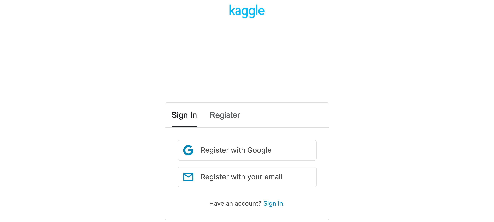
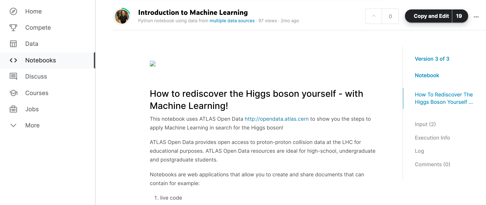

For this tutorial we will be using [Kaggle](https://www.kaggle.com/). Kaggle offers a no-setup, customizable, Jupyter Notebooks environment. Make sure you have

* [Created an account by clicking here](https://www.kaggle.com/account/login?phase=startRegisterTab&returnUrl=%2F) <---

{:width="40%"}

* Signed in

Once you are signed in, you will be given access to the full resources of a Kaggle Jupyter notebook kernel (16 GB of RAM). Once you are signed in please use the following link:

* [Please click here](https://www.kaggle.com/meirinevans/introduction-to-machine-learning/edit) <---

{:width="40%"}

* Click Copy and Edit in the top-right corner to have your own version of the notebook!


